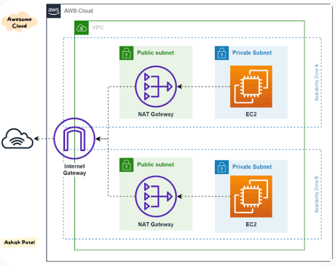
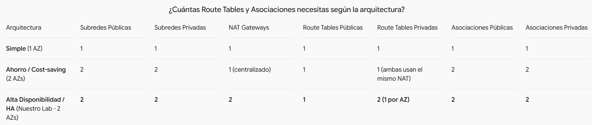
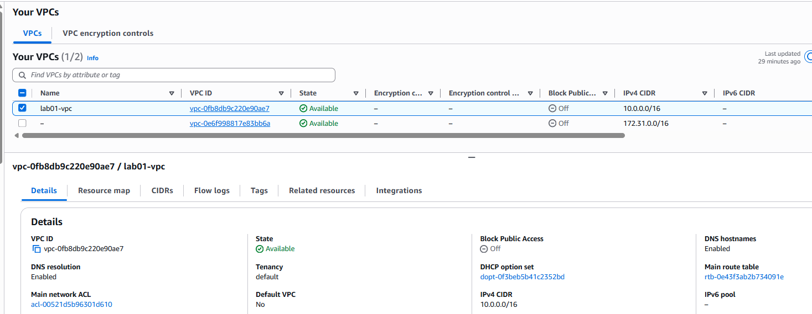
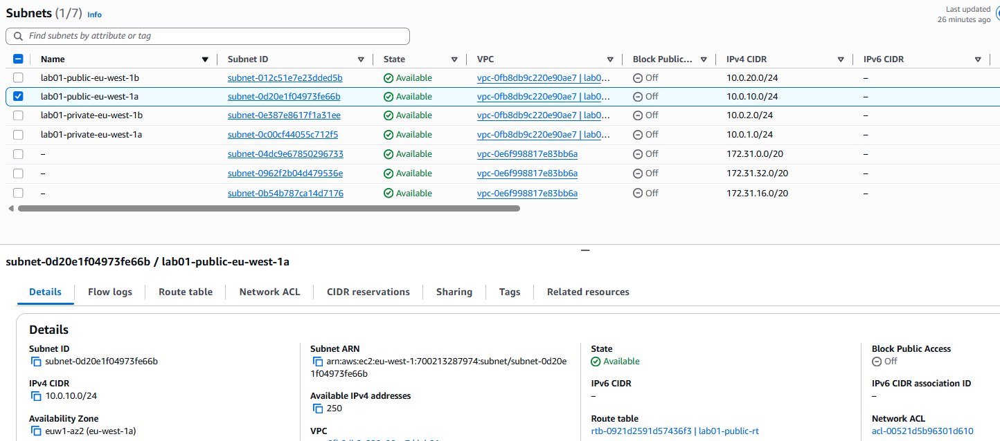
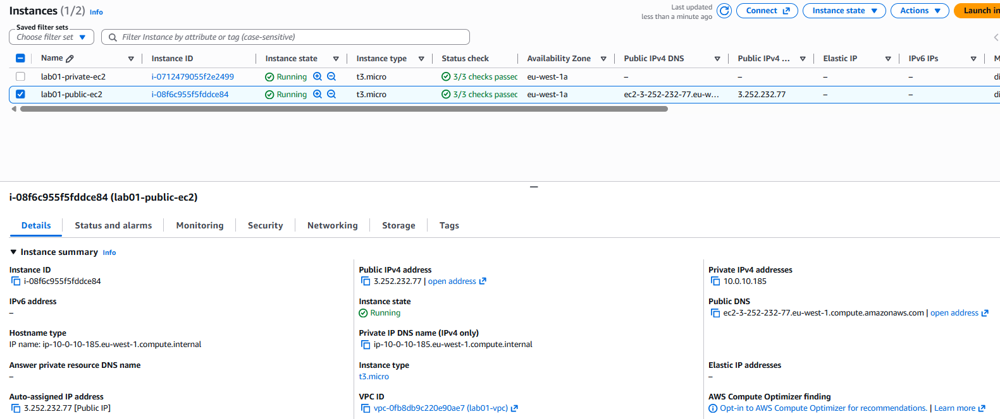
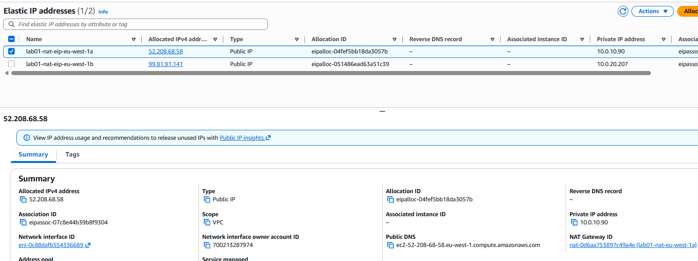
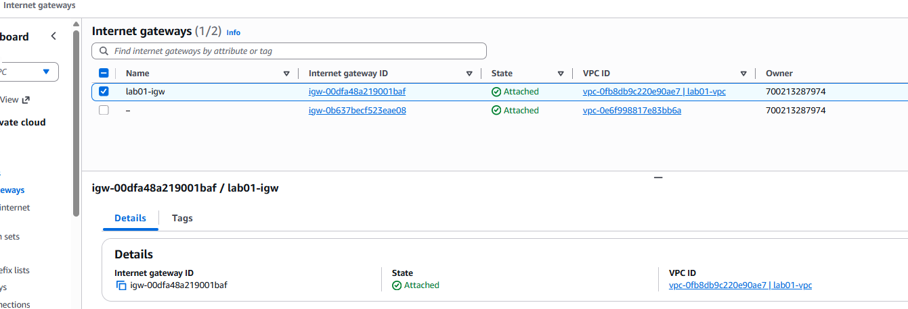
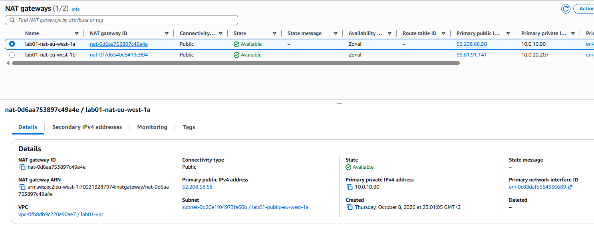
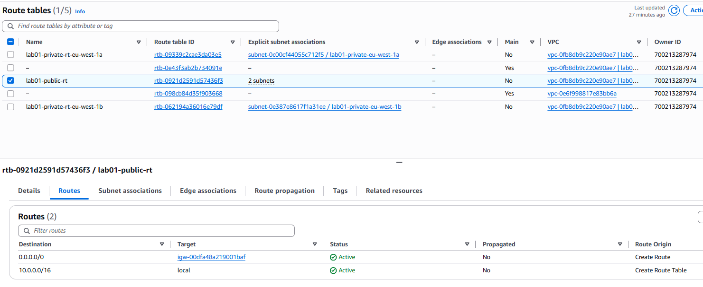
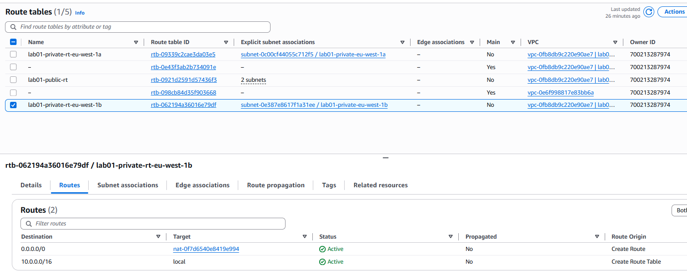

# LAB 1: VPC con 2 subredes públicas y 2 privadas

  

## Table of contents

- [Ejercicio](#ejercicio)
- [Construcción](#construccion)
- [Estructura carpeta](#estructura-carpeta)
- [Convencion de Nombres](#convencion-de-nombres)
- [Refactorizacion](#refactorizacion)
- [Route Tables](#route-tables)
- [Verificacion](#verificacion)
- [Ticket de Incidencia](#ticket-de-incidencia)
- [Resumen Laboratorio](#resumen-laboratorio)
- [Author](#author)

## Ejercicio:

+ Paso 0 (antes de tocar nada): crea la alerta en AWS Budgets (un zero spend budget o uno de 5-10 €). Es lo primero, y más aún si luego probamos un NAT Gateway.

+ Objetivo final, lo que tiene que cumplirse al acabar:
    - Una VPC con 4 subnets repartidas en 2 Availability Zones (1 pública + 1 privada por AZ).
    - Las instancias de las subnets públicas pueden salir a Internet y ser alcanzables desde él.
    - Las instancias de las subnets privadas pueden salir a Internet, pero no se puede llegar a ellas desde fuera.
    - Todo el enrutado está definido con route tables explícitas.


## Construccion

1. Direccionamiento IP y CIDR Blocks
+ VPC (10.0.0.0/16): Elección perfecta. Evitas solapamientos (overlapping) con redes domésticas u corporativas típicas.
+ Subredes (/24): El tamaño /24 te da $256 - 5 = 251$ IPs utilizables por subnet (AWS se reserva efectivamente 5 IPs en cada subred: Network, VPC Router, DNS, Future Use y Broadcast).+ Asignación propuesta:
    - Public Subnet 1 (AZ-A): 10.0.10.0/24
    - Public Subnet 2 (AZ-B): 10.0.20.0/24
    - Private Subnet 1 (AZ-A): 10.0.1.0/24
    - Private Subnet 2 (AZ-B): 10.0.2.0/24
    > Tip de arquitectura: Mantener un esquema numérico coherente (ej: impares/bajas para privadas, pares/altas para públicas) facilita mucho la lectura del código cuando trabajes con Terraform.

2. Componentes auxiliares y la duda del NAT Gateway
+ Internet Gateway (IGW): Es un componente managed, altamente disponible y sin estado (stateless) que se adjunta a la VPC.
+ NAT Gateway (NAT GW): Para resolver tu duda sobre si sale solo a Internet o no:
    - Un NAT Gateway DEBE desplegarse dentro de una Public Subnet.
    - ¿Por qué? Porque para traducir el tráfico hacia fuera necesita una Public IP (Elastic IP) y acceso directo al Internet Gateway.
    - Por tanto, el flujo de salida de un servidor privado es:EC2 Privada $\rightarrow$ Route Table Privada $\rightarrow$ NAT Gateway (en Subnet Pública) $\rightarrow$ Internet Gateway $\rightarrow$ Internet.

3. Route Tables (Tablas de Rutas)  
Para tener el tráfico totalmente aislado y explícito necesitas mínimo 2 Route Tables:
+ A. Public Route Table (Asociada a Public Subnet 1 y Public Subnet 2):
```bash
Destination,Target
10.0.0.0/16,local (Ruta por defecto de la VPC)
0.0.0.0/0,igw-xxxxxxxx (Internet Gateway)
```

+ B. Private Route Table (Asociada a Private Subnet 1 y Private Subnet 2):
```bash
Destination,Target
10.0.0.0/16,local
0.0.0.0/0,nat-xxxxxxxx (NAT Gateway)
```
> (Nota en producción/HA: Se suele usar 1 NAT Gateway por cada AZ para alta disponibilidad, lo que requeriría 2 Private Route Tables, pero para nuestro laboratorio 1 NAT Gateway centralizado es más que suficiente).

## Estructura carpeta

+ Tu proyecto debe tener esta estructura básica de ficheros:
    - providers.tf -> Configuración de AWS Provider y versión de Terraform.
    - variables.tf -> Definición de variables (CIDR de VPC, nombres, regiones, etc.).
    - main.tf -> Recursos principales (VPC, Subnets, IGW, NAT GWs, Route Tables y sus asociaciones).
    - outputs.tf -> Salida de IDs de VPC, Subnets, etc.
    - terraform.tfvars -> Valores de las variables.


## Convencion de Nombres
+ En entornos de producción se siguen estas reglas de oro:
    - main / default: Se reserva exclusivamente para recursos que solo existen una vez en toda la VPC (ej: aws_vpc.main, aws_internet_gateway.main).
    - public / private + sufijo de AZ o índice: Para recursos que se multiplican por zona de disponibilidad (AZ) o por capa (tier), el nombre debe incluir la función y la AZ o índice para identificarlo al instante en la consola o CLI.
    - Recursos duplicados vs. Bloques count: En lugar de declarar nat1, nat2, private1 y private2 por separado, usas count para que Terraform administre el número de recursos según la lista de AZs.

## Refactorizacion
+ En lugar de repetir el código, le dices a Terraform: "Crea este recurso tantas veces como subredes públicas tengamos en la lista":
```bash
resource "aws_eip" "nat" {
  count  = length(var.public_subnet_cidrs) # length es 2, así que creará 2 EIPs
  domain = "vpc"

  tags = {
    # var.availability_zones[0] será "eu-west-1a"
    # var.availability_zones[1] será "eu-west-1b"
    Name = "lab01-nat-eip-${var.availability_zones[count.index]}"
  }
}
```

## Route Tables
+ Relación 1 a 1 de Salida en Subredes Públicas:
    - Todas las subredes públicas salen a Internet por el mismo Internet Gateway (IGW).
    - Por eso SOLO necesitas 1 Tabla de Rutas Pública para todas las subredes públicas de tu VPC, sin importar si tienes 2, 5 o 10.
    - Asociaciones Públicas: Creas 1 asociación por cada subred pública vinculada a esa única tabla pública.

+ Por qué las Subredes Privadas SÍ necesitan tablas independientes cuando hay Alta Disponibilidad (HA):
    - Cada Availability Zone (AZ) tiene su propio NAT Gateway local.
    - Si la subred privada de eu-west-1a envía su tráfico a Internet, DEBE mandarlo al NAT Gateway situado en eu-west-1a.
    - Si la subred privada de eu-west-1b envía su tráfico, DEBE mandarlo al NAT Gateway de eu-west-1b.
    - Como cada subred privada apunta a un target distinto (distintos NAT Gateways), no pueden compartir la misma tabla de rutas. Cada AZ privada necesita su propia Route Table Privada.

  

## Verificacion
+ Ya tienes todo el laboratorio diseñado e implementado:
    - VPC con CIDR 10.0.0.0/16.
    - 4 Subnets (2 públicas y 2 privadas distribuidas en 2 AZs).
    - Internet Gateway adjunto a la VPC.
    - 2 Elastic IPs y 2 NAT Gateways en las subredes públicas.
    - 1 Tabla de rutas pública + 2 asociaciones.
    - 2 Tablas de rutas privadas apuntando a sus respectivos NATs + 2 asociaciones independientes.

## Ticket de Incidencia
Un desarrollador te llama diciendo:

"Oye Miguel, acabo de desplegar una app en la subred privada de eu-west-1a (subnet-0c00cf44055c712f5). La máquina arranca perfectamente, pero cuando intenta hacer llamadas HTTP externas a APIs de terceros para descargar dependencias, le da un Connection Timeout constante. Parece que no tiene salida a Internet."

🔍 Tu Misión:
Dime qué comandos de AWS CLI o qué comprobaciones exactas harías en la consola para aislar este problema de red.

Basándote en lo que hemos aprendido hoy sobre el flujo de tráfico de una subred privada, menciona los 3 puntos de fallo más probables que comprobarías en orden.

1. Prueba de Conectividad e Identificación:
    - Para probar desde la EC2 privada, la mejor alternativa es usar AWS Systems Manager (SSM) Session Manager (no necesitas SSH ni IP pública) o hacer bastion hopping desde una EC2 pública. Un curl -I [https://aws.amazon.com](https://aws.amazon.com) o traceroute nos dirá exactamente en qué salto se queda colgado.
    - En la privada si hacemos `curl https://ifconfig.me` nos da la ip publica del nat.
    - En la privada si hacemos `sudo dnf check-update` nos permite descargar dependencias de internet.
    - En la publica si hacemos `curl https://ifconfig.me` nos da la ip publica suya, ya que está en subnet publica.
    - En la publica si hacemos un ping a la ip privada de la ec2 privada nos da conexion por estar en la misma vpc.
    - Si eliminamos una de las rutas privadas a nat y probamos de nuevo la conectividad con el exterior nos dará error.


2. Comandos de AWS CLI útiles para este caso:
    - Ver la tabla de rutas asociada a la subred privada:
    ```Bash
    aws ec2 describe-route-tables --filters "Name=association.subnet-id,Values=subnet-0c00cf44055c712f5"
    ```

    - Comprobar el estado del NAT Gateway (Pending, Available, Failed):
    ```Bash
    aws ec2 describe-nat-gateways --filter "Name=vpc-id,Values=vpc-0fb8db9c220e90ae7"
    ```

3. Análisis de Puntos de Fallo:
    - Tabla de rutas / NAT Gateway (Correcto): Revisar si la ruta 0.0.0.0/0 de esa subred privada está apuntando al NAT Gateway de su zona y si dicho NAT está en estado Available.
    - Security Groups (SG) / Outbound Rules: En AWS, los Security Groups son stateful. Por defecto, permiten todo el tráfico saliente (Egress), pero si alguien modificó las Egress Rules para capar el puerto 80/443, la máquina no podrá salir.
    - NACL / Network ACLs: Como bien indicas, son stateless y actúan a nivel de subnet. Deben permitir tráfico de salida y de entrada para los puertos efímeros (1024-65535).

## RESUMEN LABORATORIO
- Diseñaste e implementaste una VPC redundante (10.0.0.0/16) con 4 subredes en 2 Availability Zones (eu-west-1a y eu-west-1b).
- Configuraste salida directa a Internet (IGW) para subredes públicas y salida segura unidireccional (NAT Gateways + EIPs) para las privadas.
- Aplicaste código Terraform modularizado con providers.tf, variables.tf, outputs.tf y el bloque default_tags para seguimiento de costes.
- Refactorizaste el código mediante el uso de count e indexación explícita para evitar duplicidades (DRY) y asegurar mapeos 1 a 1 por AZ.
- Verificaste el despliegue automático de 17 recursos en AWS y analizaste el diagnóstico de incidencias de enrutado y tablas de rutas.

  
  
  
  
  
  
  
  


## Author
+ Miguel — [GitHub](https://github.com/mamoros-dev) · [LinkedIn](https://www.linkedin.com/in/miguel-amoros-moret/)