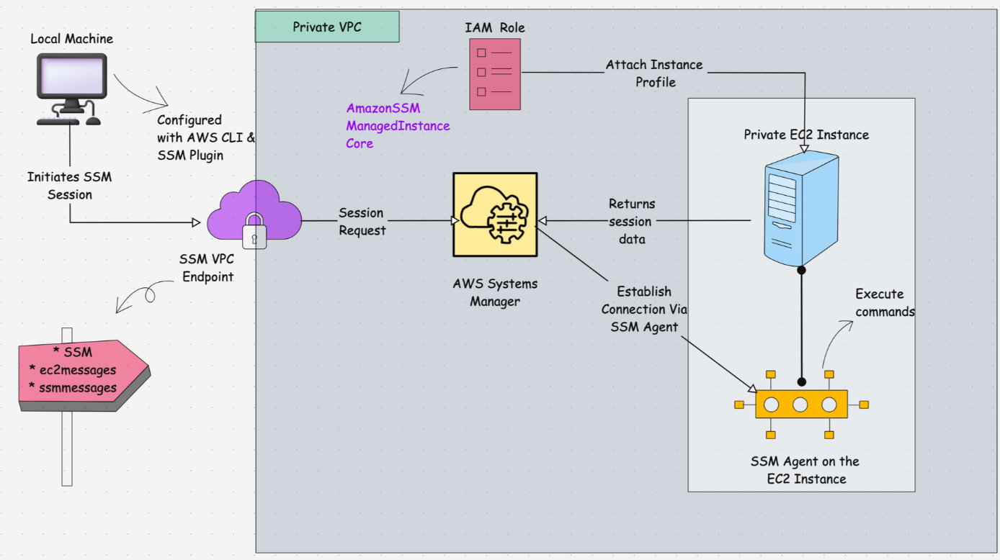
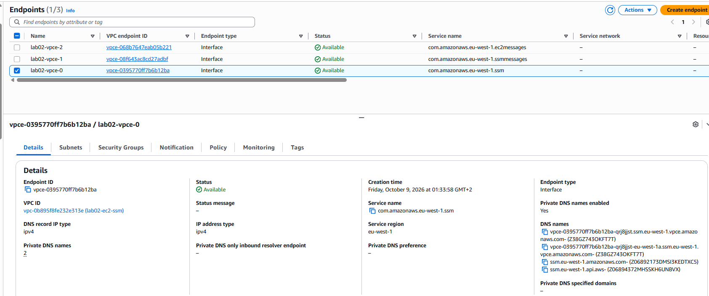
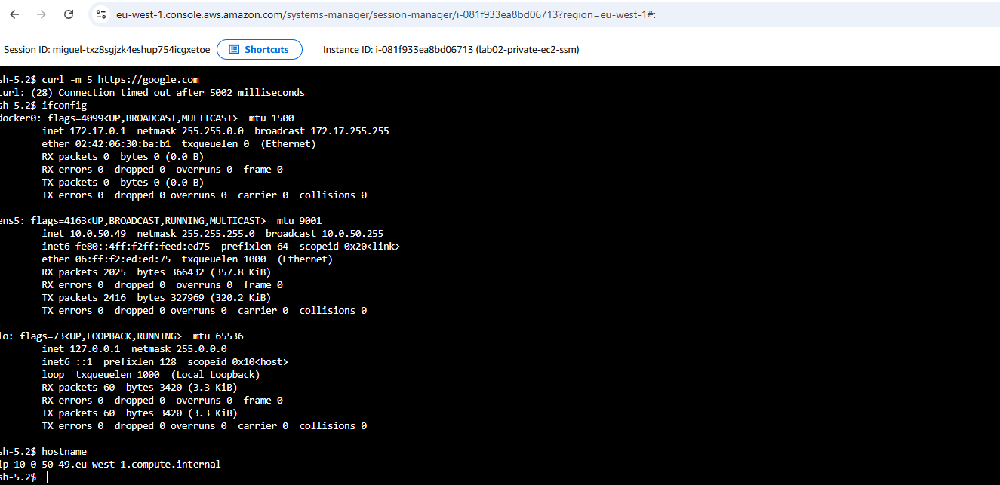

# LAB 2: Una EC2 en subred privada a la que me conecto con SSM, sin SSH:

  
## Table of contents

- [Ejercicio](#ejercicio)
- [ROL SSM](#rol-ssm)
- [Funcionamiento SSM](#funcionamiento-ssm)
- [VPC Endpoint](#vpc-endpoint)
- [Verificacion](#verificacion)
- [Author](#author)

## Ejercicio

#### Objetivo:
- Desplegar una instancia EC2 en una subred privada sin IP pública ni puerto 22 (SSH) abierto en su Security Group, configurando las políticas de IAM y servicios de AWS para permitir acceso administrativo por terminal web/CLI mediante AWS Systems Manager (SSM) Session Manager.

#### Requisitos y Objetivos del LAB 2:
- Una VPC con al menos 1 subred privada (puedes reutilizar tu módulo/código del LAB 1).
- Una instancia EC2 (Amazon Linux 2023) ubicada exclusivamente en la subred privada (sin IP pública).
- Un Security Group estricto sin reglas de entrada (ingress vacío o totalmente cerrado al puerto 22).
- Configuración de un IAM Role y un Instance Profile con la política adecuada para SSM.
- Acceso mediante AWS Systems Manager Session Manager desde la consola web o AWS CLI.

#### Tu Reto de Diseño (Responde antes de tirar código):Seguridad: 
- ¿Por qué usar SSM Session Manager es infinitamente más seguro en empresas que abrir el puerto 22/SSH con un Bastion Host o Jump Server?
> Seguridad: Al no exponer el puerto 22 ni IPs públicas, reduces la superficie de ataque a cero frente a escaneos y ataques de fuerza bruta en Internet.
- Componentes IAM: Nombra los 3 recursos de IAM que necesitas declarar en Terraform para que la EC2 pueda autenticarse contra el servicio SSM de AWS.
> La secuencia es Role $\rightarrow$ Policy Attachment $\rightarrow$ Instance Profile.
- Conectividad: En este laboratorio, la máquina estará en una subred privada. ¿Cómo llega el tráfico del agente SSM a los servidores de AWS si la máquina no tiene IP pública ni SSH?
> En el LAB 1: Conectamos con SSM a la EC2 privada porque teníamos un NAT Gateway que le permitía al agente SSM llegar a la API de AWS en Internet (ssm.eu-west-1.amazonaws.com).  

> En el LAB 2 (Sin NAT Gateway ni Internet Gateway): Si la subred privada está 100% aislada de Internet (sin NAT GW), el agente SSM fallará al registrarse salvo que creemos VPC Endpoints (PrivateLink) dentro de la VPC para que el tráfico vaya directo a la API de AWS por la red interna de Amazon.

## ROL SSM

+ **aws_iam_role (El Rol y la relación de confianza):**
```bash
resource "aws_iam_role" "ssm_role" {
  name = "lab02-ssm-role"

  assume_role_policy = jsonencode({
    Version = "2012-10-17"
    Statement = [{
      Action = "sts:AssumeRole"
      Effect = "Allow"
      Principal = {
        Service = "ec2.amazonaws.com"
      }
    }]
  })
}
```
> assume_role_policy (Trust Relationship): Es la política que define QUIÉN puede asumir este rol. Le estás diciendo a AWS: "Autorizo al servicio de computación ec2.amazonaws.com a solicitar credenciales temporales con este rol".

+ **aws_iam_role_policy_attachment (Los Permisos)**
```bash
resource "aws_iam_role_policy_attachment" "ssm_policy" {
  role       = aws_iam_role.ssm_role.name
  policy_arn = "arn:aws:iam::aws:policy/AmazonSSMManagedInstanceCore"
}
```
> AmazonSSMManagedInstanceCore: Es una política gestionada por AWS (AWS Managed Policy) que contiene los permisos mínimos necesarios (acciones como ssm:UpdateInstanceInformation, ssmmessages:*, etc.) para que el agente SSM dentro del sistema operativo pueda comunicarse con la nube.

+ **aws_iam_instance_profile (El Puente entre IAM y EC2)**
```bash
resource "aws_iam_instance_profile" "ssm_profile" {
  name = "lab02-ssm-instance-profile"
  role = aws_iam_role.ssm_role.name
}
```
> ¿Por qué hace falta esto? En AWS no puedes asociar un IAM Role directamente a una EC2. Necesitas un contenedor llamado Instance Profile que pasa las credenciales al servicio de metadata de la instancia (169.254.169.254).

## Funcionamiento SSM

+ El SSM Agent es un binario que corre dentro del sistema operativo de la EC2 (como un servicio systemd en Linux).

+ El agente no escucha peticiones entrantes (por eso no necesitas puerto 22 ni IP pública). Lo que hace el agente es iniciar conexiones salientes (outbound) hacia las APIs del servicio AWS SSM en la nube para preguntar: “¿Hay algún comando o sesión de terminal para mí?”

+ Para que esa comunicación saliente funcione, la EC2 en la subred privada solo tiene 2 caminos posibles:
```bash
[EC2 Privada con SSM Agent]
            │
            ├───────> OPCIÓN A: Vía NAT Gateway ───> Internet ───> API SSM (ssm.eu-west-1.amazonaws.com)
            │
            └───────> OPCIÓN B: Vía VPC Endpoints (PrivateLink) ──> Red Privada AWS ──> API SSM
```
> Opción A (Con salida a Internet): Lo que hicimos en el LAB 1. La EC2 privada usaba la tabla de rutas hacia el NAT Gateway para llegar a la IP pública de la API de SSM en Internet.

> Opción B (100% Privada y Aislada - LAB 2): SIN NAT Gateway ni Internet. Toda la red permanece aislada. Creamos VPC Endpoints (placas de red privadas / ENIs virtuales) dentro de tu subred para que la EC2 hable con la API de SSM a través de la red interna de AWS, sin tocar Internet jamás.

## VPC Endpoint
+ Un Interface Endpoint genera una interfaz de red privada (ENI) con una IP privada de tu propia subred (por ejemplo 10.0.50.X).

+ Gracias a private_dns_enabled = true, AWS altera automáticamente la resolución DNS dentro de la VPC: cuando el agente de la EC2 busca la URL ssm.eu-west-1.amazonaws.com, en lugar de resolver a una IP pública de Internet, resuelve directamente a la IP privada del VPC Endpoint.

#### Security Group para los VPC Endpoints (443 HTTPS)

```bash
# --- Security Group para los VPC Endpoints ---
resource "aws_security_group" "vpc_endpoints_sg" {
  name        = "lab02-vpc-endpoints-sg"
  description = "Allow inbound HTTPS traffic from VPC for SSM endpoints"
  vpc_id      = aws_vpc.main.id

  # Permite que la EC2 (10.0.0.0/16) conecte al endpoint por el puerto 443
  ingress {
    from_port   = 443
    to_port     = 443
    protocol    = "tcp"
    cidr_blocks = [var.vpc_cidr]
  }

  egress {
    from_port   = 0
    to_port     = 0
    protocol    = "-1"
    cidr_blocks = ["0.0.0.0/0"]
  }

  tags = {
    Name = "lab02-vpc-endpoints-sg"
  }
}
```

#### Los 3 VPC Endpoints de SSM
Has puesto la sintaxis perfecta en tu ejemplo. En la región eu-west-1, necesitamos estos 3 servicios:
```bash
# --- Lista de servicios SSM necesarios ---
locals {
  ssm_services = [
    "com.amazonaws.${var.region}.ssm",
    "com.amazonaws.${var.region}.ssmmessages",
    "com.amazonaws.${var.region}.ec2messages"
  ]
}

# --- VPC Endpoints con count ---
resource "aws_vpc_endpoint" "ssm_endpoints" {
  count               = length(local.ssm_services)
  vpc_id              = aws_vpc.main.id
  service_name        = local.ssm_services[count.index]
  vpc_endpoint_type   = "Interface"
  subnet_ids          = [aws_subnet.main.id]
  security_group_ids  = [aws_security_group.vpc_endpoints_sg.id]
  private_dns_enabled = true

  tags = {
    Name = "lab02-vpce-${count.index}"
  }
}
```
> service_name: El nombre exacto del API de AWS que queremos consumir de forma privada.

> vpc_endpoint_type = "Interface": Crea una interfaz de red con IP de tu subred privada 10.0.50.X.

> security_group_ids: Controla qué tráfico puede llamar al endpoint (en este caso, abrimos el puerto 443 HTTPS para toda la VPC).

> private_dns_enabled = true: Redirige la resolución DNS pública del servicio de AWS a la IP privada del endpoint.

## Verificacion

Esta es la magia de los VPC Endpoints (PrivateLink):
- Cuando abres la consola de AWS y le das a Session Manager, tu navegador no se conecta directamente a la IP de la EC2.
- Tu navegador habla con el servicio AWS Systems Manager en la nube.
- Dentro de la EC2, el agente SSM necesita hablar con la API de AWS.
- Sin VPC Endpoints, la EC2 buscaría la ruta hacia Internet para llegar a ssm.eu-west-1.amazonaws.com. Como no hay NAT GW ni IGW, fallaría.
- Al crear los VPC Endpoints, AWS crea tarjetas de red virtuales (ENIs) con IPs privadas de tu propia subred (10.0.50.X). El agente SSM dentro de la EC2 envía todo el tráfico a esa IP privada local. El paquete viaja por la red de fibra privada interna de AWS, sin salir jamás a Internet.

La prueba definitiva (Comprueba el aislamiento):
- Entra en la EC2 por la terminal web de Session Manager y ejecuta:
```Bash
curl -m 5 https://google.com
```
> Verás que da Connection Timeout. La instancia está 100% aislada de Internet, pero puedes administrarla por SSM gracias a los VPC Endpoints.

  

  

## Author
+ Miguel — [GitHub](https://github.com/mamoros-dev) · [LinkedIn](https://www.linkedin.com/in/miguel-amoros-moret/)