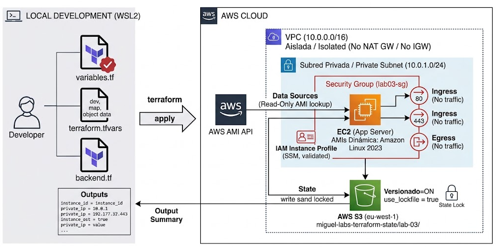
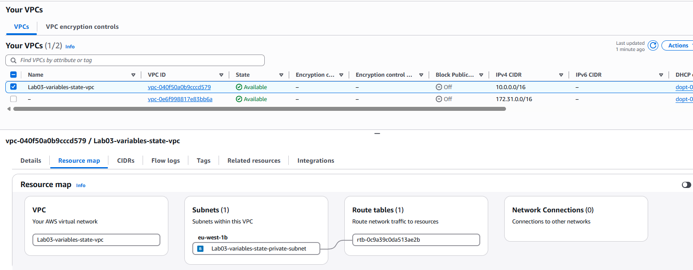
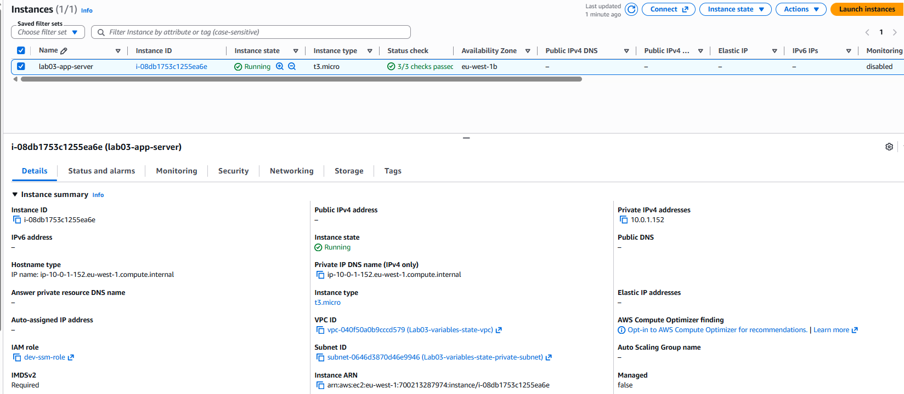

# LAB 3: Variables avanzadas, Outputs, Remote State en S3/DynamoDB y Módulos local/AWS

  

## Table of contents

- [Ejercicio](#ejercicio)
- [Tipos de Variables](#tipos-de-variables)
- [Verificacion](#verificacion)
- [Author](#author)

## Ejercicio

Objetivo:
+ Estructurar un proyecto de Terraform preparado para entornos reales (Multi-Entorno: dev/prod), utilizando variables tipadas con validaciones, outputs estructurados, búsqueda dinámica de recursos con data sources, y migrando el archivo de estado (terraform.tfstate) desde local hacia un Backend Remoto en AWS (S3 + DynamoDB) para bloqueo de concurrencia y seguridad.

+ Para aplicar Gestión Avanzada de Variables, Data Sources y Outputs Estructurados, vamos a montar un Servidor de Aplicación en Subred Privada con la siguiente arquitectura:
    - VPC y Subred Privada alimentadas por variables.
    - Security Group estricto creado mediante un bloque dynamic o variables tipadas complejas.
    - EC2 Privada con SSM que consulte dinámicamente la AMI mediante data "aws_ami".

Requisitos Técnicos del Laboratorio
+ Gestión Avanzada de Variables (variables.tf & terraform.tfvars):
    - Definir variables estricta y explícitamente tipadas (string, list, map, object).
    - Añadir bloques de validación (validation) en Terraform (ej: asegurar que el tipo de instancia solo sea de la familia t3 o t2, o que el CIDR sea válido).
    - Separar valores por entorno mediante archivos .tfvars (ej: dev.tfvars).

+ Backend Remoto Seguro (providers.tf / backend.tf):
    - Crear un Bucket S3 con cifrado (SSE-KMS/AES256) y versionado activado para almacenar el terraform.tfstate.
    - Crear una Tabla DynamoDB con LockID para evitar que dos ejecuciones simultáneas de terraform apply corrompan el estado (State Locking).
    - Configurar el bloque backend "s3" para que Terraform guarde el estado en la nube.

+ Data Sources y Outputs Estructurados:
- Consultar la última AMI de Amazon Linux 2023 y la VPC por defecto o creada mediante data "aws_..." en lugar de hardcodear IDs.
- Crear un outputs.tf profesional que exponga un mapa estructurado con la información clave de la infraestructura.

Tu Reto de Diseño (Responde antes de tirar código)
+ Para asegurar que tenemos los conceptos asentados antes de picar el código:
    - Backend Remoto: ¿Por qué guardar el terraform.tfstate en Git es una pésima práctica de seguridad y un riesgo crítico en un equipo DevOps? (Cita al menos 2 razones).
    > Seguridad del .tfstate: Totalmente. Guarda información sensible en texto plano (contraseñas, tokens, claves privadas, IPs) y si se sube a Git se expone en el historial para siempre. Además, causa conflictos inasumibles (git merge conflicts) si dos personas modifican el estado a la vez.
    - State Locking: ¿Qué función exacta cumple la tabla de DynamoDB cuando configuramos el backend de S3 en Terraform?
    > State Locking: Exacto. Es el mecanismo de concurrencia para evitar que dos terraform apply simultáneos pisen o corrompan el archivo de estado.
    - Data Sources: ¿Cuál es la diferencia técnica entre un bloque resource "aws_instance" y un bloque data "aws_ami"?
    > resource vs data: Tal cual. resource gestiona el ciclo de vida (crea, modifica, destruye) y data es de solo lectura para consultar la infraestructura existente.


## Tipos de Variables

1. Variable con Validación (string + validation):  
Garantiza que el usuario solo despliegue tipos de instancias permitidas en desarrollo para evitar sobrecostes.

```bash
variable "instance_type" {
  description = "Tipo de instancia EC2 permitida"
  type        = string
  default     = "t3.micro"

  validation {
    condition     = contains(["t2.micro", "t3.micro", "t3.small"], var.instance_type)
    error_message = "Error: El tipo de instancia debe ser t2.micro, t3.micro o t3.small."
  }
}
```


2. Variable Tipo Lista (list(string)):  
Para manejar múltiples bloques CIDR o puertos sin duplicar código.

```bash
variable "allowed_ingress_ports" {
  description = "Lista de puertos de entrada permitidos"
  type        = list(number)
  default     = [443, 80]
}
```


3. Variable Tipo Mapa (map(string)):  
Para mapear configuraciones específicas según el entorno (dev, prod).

```bash
variable "environment_config" {
  description = "Mapeo de configuraciones por entorno"
  type        = map(string)
  default = {
    dev  = "10.0.0.0/16"
    prod = "10.1.0.0/16"
  }
}
```


4. Variable Tipo Objeto (object({...})):  
Ideal para pasar estructuras complejas a un módulo o recurso de una sola vez.

```bash
variable "server_config" {
  description = "Objeto con la configuración detallada del servidor"
  type = object({
    name          = string
    ebs_size_gb   = number
    enable_backup = bool
  })
  default = {
    name          = "lab03-app-server"
    ebs_size_gb   = 20
    enable_backup = false
  }
}
```

## Verificacion

+ Listamos el s3 que se haya guardado bien en nuestro bucket:
```bash
# Listar los objetos de tu bucket S3 de estado
aws s3 ls s3://miguel-labs-terraform-state/lab-03/
2026-10-09 16:08:41      19426 terraform.tfstate
```

+ Componentes creados:

  

  

+ Has dominado:
    - Estado Remoto: S3 Native Locking (use_lockfile = true) y cifrado.
    - Tipado de Variables: list, map, object y bloques de validation personalizados.
    - Data Sources: Consultas dinámicas de AMIs y recursos existentes.
    - Outputs Estructurados: Mapas de salida para consumo externo/pipelines.
    - Aislamiento de Red: Diagnóstico preciso de conectividad en VPCs sin salida.

## Author
+ Miguel — [GitHub](https://github.com/mamoros-dev) · [LinkedIn](https://www.linkedin.com/in/miguel-amoros-moret/)