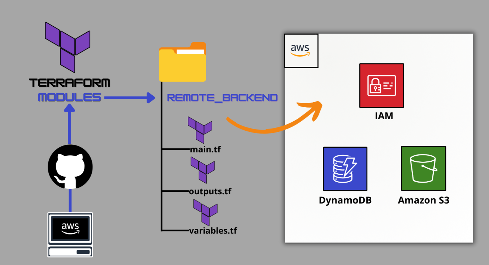
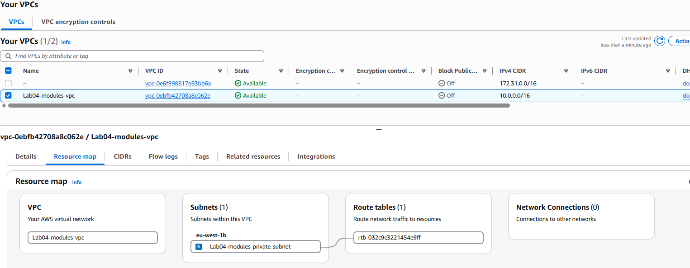
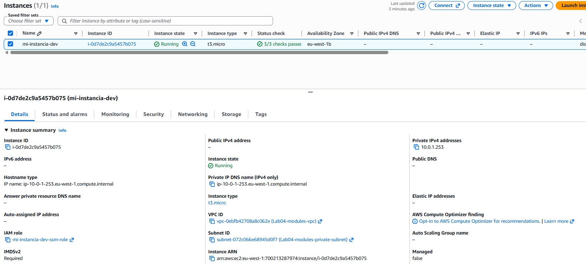
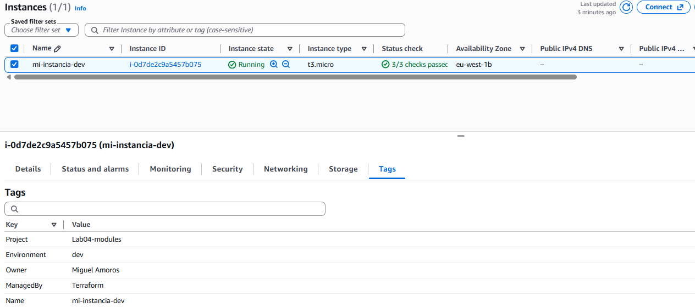

# LAB 4: MODULOS TERRAFORM

  

## Table of contents

- [Ejercicio](#ejercicio)
- [Tipos de Variables](#tipos-de-variables)
- [Verificacion](#verificacion)
- [Author](#author)

## Ejercicio

#### Requisitos y Objetivos del LAB 5:

+ Creación de Módulo Local: Diseñar un módulo independiente (por ejemplo, modules/aws-compute) que encapsule todos los recursos necesarios para una EC2 segura en subred privada.
+ Paramectrización: Definir entradas (variables.tf del módulo) para permitir que el root module decida la VPC, el tipo de instancia y el nombre, sin que el módulo tenga valores harcodeados.
+ Encapsulamiento y Outputs: Exponer únicamente la información necesaria del módulo (ej: instance_id, security_group_id) mediante el outputs.tf del módulo.
+ Uso del Módulo (Root Module): Instanciar el módulo en el main.tf principal (root) y validar su correcto despliegue.

#### Tu Reto de Diseño (Responde antes de crear las carpetas):

Para este laboratorio, vamos a "empaquetar" la EC2 que hemos hecho en el LAB 3-4 en un módulo.
+ Inputs del Módulo: Nombra al menos 4 variables que necesitas definir en el variables.tf del módulo para que este sea verdaderamente reutilizable en cualquier VPC de AWS.
> Inputs: Esos 5 parámetros (project_name, vpc_id / subnet_id, environment, instance_type, etc.) son exactamente los que convierten un módulo en un bloque 100% genérico y reutilizable.

+ Outputs del Módulo: ¿Qué valor único debería devolver el módulo para que el root module pueda asociarle un Security Group externo adicional si fuera necesario?
> Outputs: Devolver aws_security_group.xxx.id (o instance_id) permite encadenar el módulo con otros recursos de la infraestructura.

+ Encapsulamiento: ¿Qué pasaría si intentas referenciar una variable definida en el root module desde dentro del módulo (modules/aws-compute/main.tf) sin pasarla como un input explícito?
> Cero acceso implícito. Un módulo es una "caja negra"; no puede leer las variables del root module salvo que se las pases explícitamente como argumentos.

## Modulos

+ Piensa en un módulo como una función en Python/Bash:
    - variables.tf del módulo (Inputs): Son los parámetros de entrada de la función. Cuando pones variable "vpc_id" {} sin valor default, le estás diciendo a Terraform: "Esta función necesita una VPC para trabajar, pero quien me llame me tiene que pasar cuál es".
    - module "mi_instancia_ec2" (La llamada): Es ejecutar la función pasándole los argumentos reales. Le dices: vpc_id = aws_vpc.main.id (toma la VPC que acabo de crear en la raíz).
    - outputs.tf del módulo (Return): Es el retorno de la función. Como los recursos se crean dentro de la "caja negra", la raíz no sabe qué IP o ID se ha generado salvo que el módulo lo exponga explícitamente con un output.

```bash
ROOT MODULE (Raíz)                        CHILD MODULE (modules/aws_private_ec2)
┌──────────────────────────┐             ┌────────────────────────────────────┐
│ 1. Crea aws_vpc.main     │             │ 1. Pide inputs en variables.tf:    │
│                          │  PASO 1     │    - vpc_id                       │
│ 2. Llama al módulo:      ├────────────►│    - subnet_id                    │
│    vpc_id = aws_vpc.id   │  (Inputs)   │                                    │
│    subnet_id = ...       │             │ 2. Crea EC2 + SG en main.tf        │
│                          │             │                                    │
│ 3. Consume respuestas    │  PASO 2     │ 3. Devuelve datos en outputs.tf:   │
│    module.ec2.private_ip ◄─────────────┤    - private_ip                    │
└──────────────────────────┘  (Outputs)  └────────────────────────────────────┘
```

+ Para que en el main principal podamos añadir algo a la instancia, ésta tiene que tener en su propio main y variables, la variable a la que referencia.
```bash
modulo
# 4. Instancia EC2 Privada
resource "aws_instance" "ec2" {
  ami                  = data.aws_ami.amazon_linux.id
  instance_type        = var.instance_type # <--- Recibido desde el Root Module
  subnet_id            = var.subnet_id     # <--- Recibido desde el Root Module
  vpc_security_group_ids = [aws_security_group.module_sg.id]
  iam_instance_profile = aws_iam_instance_profile.ssm_profile.name

  tags = {
    Name        = var.instance_name
    Environment = var.environment
  }
}

variable modulo
variable "vpc_id" {
  description = "ID de la VPC donde se desplegará el Security Group"
  type        = string
}

variable "subnet_id" {
  description = "ID de la subred donde se ubicará la EC2"
  type        = string
}

variable "instance_type" {
  description = "Tipo de instancia EC2"
  type        = string
  default     = "t3.micro"
}

variable "environment" {
  description = "Entorno de despliegue (dev, stage, prod)"
  type        = string
  default     = "dev"
}
```

En el main principal:
```bash
main.tf
resource "aws_vpc" "main" {
  cidr_block = var.vpc_cidr
  # Esto garantiza que las instancias EC2 reciban nombres de dominio DNS públicos/privados
  enable_dns_hostnames = true
  enable_dns_support   = true

  tags = {
    Name = "${var.project_name}-vpc"
  }
}

# --- Private Subnet ---
# --- Subred privada ---
resource "aws_subnet" "main" {
  vpc_id     = aws_vpc.main.id
  cidr_block = var.private_subnet_cidrs[0] # el modulo definimos un string no lista por eso sin corchetes

  tags = {
    Name = "${var.project_name}-private-subnet"
  }
}

variables.tf
variable "project_name" {
  description = "Project name"
  type        = string
  default     = "Lab04-modules"
}

variable "vpc_cidr" {
  description = "CIDR block for the VPC"
  type        = string
  default     = "10.0.0.0/16"
}

variable "private_subnet_cidrs" {
  description = "List of CIDR blocks for private subnets"
  type        = list(string)
  default     = ["10.0.1.0/24"]
}

variable "environment" {
  description = "Entorno de despliegue (dev, stage, prod)"
  type        = string
  default     = "dev"
}

variable "region" {
  description = "AWS region to deploy resources"
  type        = string
  default     = "eu-west-1"
}
```

## Outputs modulos
+ Si en el output del main principal se quiere llamar a un output del modulo hay que llamarlo con:
`module.<NOMBRE_DEL_BLOQUE_MODULO>.<NOMBRE_DEL_OUTPUT_EN_EL_MODULO>`

```bash
output "server_summary" {
  description = "Resumen estructurado de la infraestructura desplegada mediante módulos"
  value = {
    instance_id       = module.mi_instancia_ec2.instance_id
    private_ip        = module.mi_instancia_ec2.private_ip
    security_group_id = module.mi_instancia_ec2.security_group_id
    subnet_id         = aws_subnet.main.id
    ami_used          = module.mi_instancia_ec2.ami_id        # <--- Acceso limpio sin "output."
    architecture      = module.mi_instancia_ec2.architecture  # <--- Acceso limpio sin "output."
  }
}
```

+ Los outputs de un módulo secundario (Child Module) NO se imprimen directamente en la consola al hacer terraform apply.

+ Es por puro diseño de Terraform para mantener la pantalla limpia y no saturar la consola cuando utilizas decenas de módulos en un proyecto grande.
    - Child Module (/modules/aws_private_ec2/outputs.tf): Los outputs declarados aquí solo se exportan internamente para que el código del Root Module (la raíz) pueda leerlos. Actúan como el return de una función.
    - Root Module (/outputs.tf en la raíz): Únicamente los outputs que defines en la raíz del proyecto son los que Terraform imprime por pantalla tras el apply o al ejecutar terraform output.

```bash
CHILD MODULE (modules/aws_private_ec2/outputs.tf)
├── output "ami_id" --------┐ (Exporta internamente)
└── output "private_ip" ----┼┐
                            ││
                            ▼▼
ROOT MODULE (outputs.tf en la raíz)
└── output "server_summary" {
      value = {
        ami_used   = module.mi_instancia_ec2.ami_id     <-- Lee el valor interno
        private_ip = module.mi_instancia_ec2.private_ip <-- Lee el valor interno
      }
    } ----------------------------------------------------► IMPRIME EN PANTALLA
```
> Si en la raíz no hubieras mapeado esos valores en tu output "server_summary", Terraform habría desplegado todo correctamente, pero los datos del módulo habrían permanecido "ocultos" de la terminal.

## Verificacion

+ Resultados:
```bash
Apply complete! Resources: 7 added, 0 changed, 0 destroyed.

Outputs:

private_ec2_ip = "10.0.1.253"
private_subnet_id = "subnet-072c066e68945d0f7"
server_summary = {
  "ami_used" = "ami-0fba8dc0a5d7e5296"
  "architecture" = "x86_64"
  "instance_id" = "i-0d7de2c9a5457b075"
  "private_ip" = "10.0.1.253"
  "security_group_id" = "sg-0d45515e40d695950"
  "subnet_id" = "subnet-072c066e68945d0f7"
}
vpc_id = "vpc-0ebfb42708a8c062e"
```
  
  


## Author
+ Miguel — [GitHub](https://github.com/mamoros-dev) · [LinkedIn](https://www.linkedin.com/in/miguel-amoros-moret/)