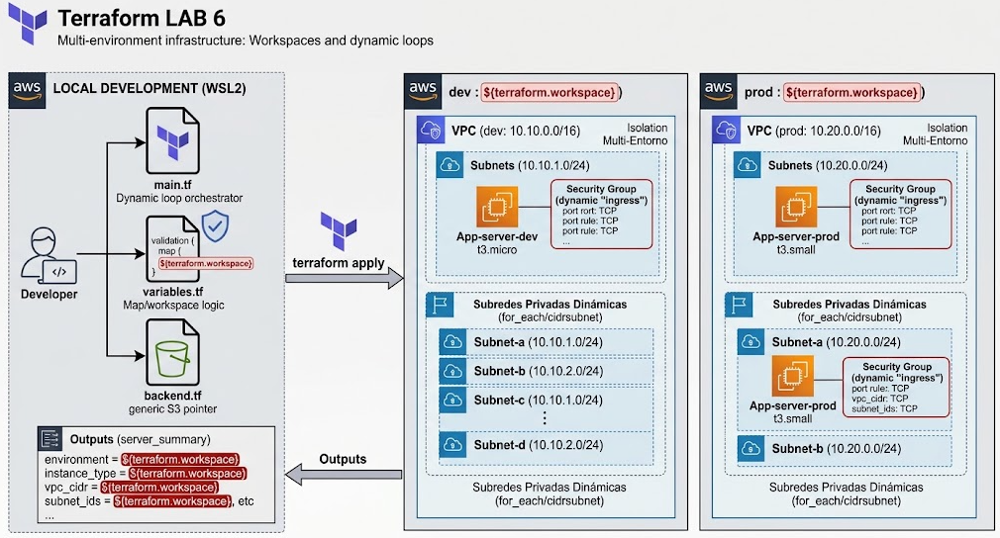
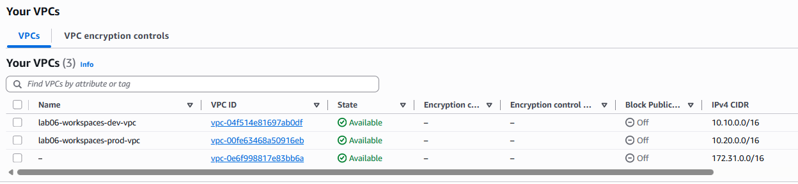
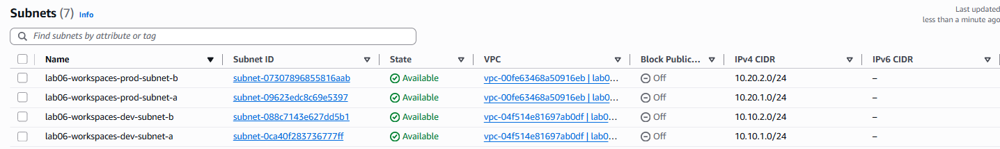
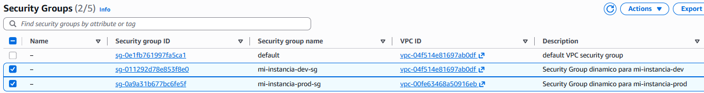
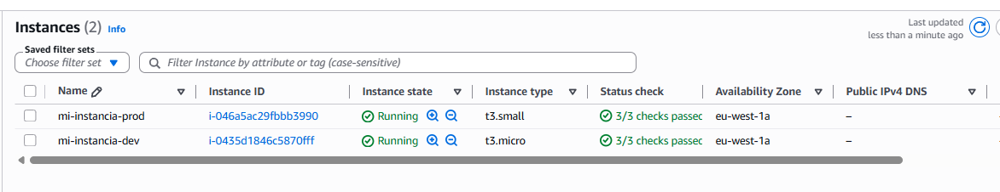

# LAB 6: Despliegue Multi-Entorno con Workspaces, Loops (for_each/count) y Módulos Avanzados

  

+ Orquestación en WSL2: Muestra cómo el main.tf central (el orquestador) utiliza el mismo código para desplegar en dev y prod. Se destaca la lógica de interpolación ${terraform.workspace} que alimenta las variables dinámicas, validaciones, mapas y el backend.tf genérico.

+ Aislamiento Multi-Entorno: Se aprecian dos bloques de AWS completamente aislados: VPC dev (10.10.0.0/16) y VPC prod (10.20.0.0/16).

+ Loops Dinámicos: En ambas VPCs, se ilustra la creación de múltiples subredes privadas dinámicas (subnet-a, subnet-b) mediante for_each y la función cidrsubnet().

+ Recursos Encapsulados: Las instancias EC2 se muestran con sus nombres y tipos de instancia dinámicos (App-server-dev t3.micro vs App-server-prod t3.small), y sus Security Groups definidos mediante bloques dynamic "ingress".

+ Outputs Consolidados: Muestra cómo el server_summary combina la información de ambos entornos en un mapa estructurado de salida.

## Table of contents

- [Ejercicio](#ejercicio)
- [Comandos CLI Terraform Workspaces](#comandos-cli-terraform-workspaces)
- [Configuracion de backend y providers](#configuracion-de-backend-y-providers)
- [Configuracion de variables](#configuracion-de-variables)
- [Main con for each](#main-con-for-each)
- [Modulo Local con Bloques dynamic](#modulo-local-con-bloques-dynamic)
- [Verificacion](#verificacion)
- [Author](#author)

## Ejercicio

#### Objetivo
+ Evolucionar la arquitectura modular del LAB 5 para soportar despliegues dinámicos y escalables. Utilizaremos Terraform Workspaces para gestionar múltiples entornos (dev y prod) de forma aislada dentro del mismo backend S3, e introduciremos estructuras de control dinámicas (for_each, count, dynamic blocks) para desplegar múltiples subredes e instancias EC2 mediante módulos sin duplicar código.

#### Requisitos Técnicos del Laboratorio
+ Aislamiento Multi-Entorno con Workspaces:
    - Crear y gestionar entornos separados (terraform workspace new dev / prod).
    - Mapear nombres de recursos y tamaños de instancias de forma dinámica utilizando ${terraform.workspace}.

+ Iteración Dinámica (for_each y count):
    - Refactorizar la red en la raíz para desplegar múltiples subredes privadas a partir de una lista/mapa de CIDRs en variables.tf.
    - Utilizar for_each al llamar al módulo aws_private_ec2 para aprovisionar un clúster de servidores (ej: app-server-1, app-server-2) con un solo bloque module.

+ Security Groups Dinámicos (dynamic "ingress"):
    - Refactorizar el módulo de EC2 para aceptar una lista de objetos con reglas de puerto e iterar mediante bloques dynamic.

#### Tu Reto de Diseño (Responde antes de tirar código)
+ Terraform Workspaces: Cuando trabajas en un workspace llamado prod, ¿dónde y cómo guarda Terraform el estado dentro de tu bucket S3 de backend?
> Con Terraform Workspaces, mantienes un único archivo backend.tf. Terraform crea automáticamente una estructura de prefijos dentro de tu mismo bucket S3:  
    - Workspace default: lab-06/terraform.tfstate  
    - Workspace dev: env:/dev/lab-06/terraform.tfstate  
    - Workspace prod: env:/prod/lab-06/terraform.tfstate  
    Esto te permite cambiar de entorno con solo hacer terraform workspace select dev o prod.  

+ count vs for_each: Si borras el segundo elemento de una lista gestionada con count, ¿qué le ocurre al resto de los recursos? ¿Por qué es más seguro usar for_each con mapas?
> count (Basado en lista/índice): Trata los recursos como un array numérico ([0], [1], [2]). Si eliminas el elemento [0], Terraform renombrará todos los elementos restantes, provocando que destruya y vuelva a crear instancias que no querías tocar.

> for_each (Basado en clave/mapa): Asocia cada recurso a una clave única (ej: "app-server-dev"). Si eliminas una clave, solo se destruye esa instancia específica, manteniendo intactas las demás. Es la opción recomendada en producción.

+ Bloque dynamic: ¿Para qué sirve un bloque dynamic "ingress" dentro de un recurso de Terraform y qué ventaja ofrece sobre declarar ingress fijos?
> En lugar de escribir 5 bloques ingress { ... } repetidos en un Security Group, usas un bloque dynamic "ingress" que itera sobre una lista de variables (puertos, protocolos, CIDRs). Así creas reglas de red de forma flexible según lo que le pases por variable.


## Comandos CLI Terraform Workspaces
Los workspaces te permiten aislar estados dentro del mismo backend sin modificar el código:

```Bash
# 1. Listar todos los workspaces existentes (* indica el activo)
terraform workspace list

# 2. Crear un nuevo workspace (ej: dev o prod) y cambiar automáticamente a él
terraform workspace new dev
terraform workspace new prod

# 3. Cambiar entre workspaces existentes
terraform workspace select dev
terraform workspace select prod

# 4. Mostrar el workspace actual en el que estás trabajando
terraform workspace show

# 5. Eliminar un workspace (debe estar vacío y no ser el activo)
terraform workspace select default
terraform workspace delete dev
```

## Configuracion de backend y providers
En backend.tf únicamente definimos el bucket S3 centralizado. Terraform se encarga automáticamente de crear la subcarpeta `env:/<workspace_name>/` para aislar el terraform.tfstate de cada entorno:

```bash
terraform {
  required_version = ">= 1.9"

  required_providers {
    aws = {
      source  = "hashicorp/aws"
      version = "~> 5.60"
    }
  }

  backend "s3" {
    bucket       = "miguel-labs-terraform-state"
    key          = "lab-06/terraform.tfstate" # Ruta base
    region       = "eu-west-1"
    use_lockfile = true # State Locking nativo en S3
    encrypt      = true
  }
}
```
> Estructura resultante en tu Bucket S3:  
Workspace dev  -> miguel-labs-terraform-state/env:/dev/lab-06/terraform.tfstate  
Workspace prod -> miguel-labs-terraform-state/env:/prod/lab-06/terraform.tfstate  

Crea también el archivo providers.tf utilizando ${terraform.workspace} en las etiquetas por defecto:

```bash
provider "aws" {
  region = var.region

  default_tags {
    tags = {
      Project     = var.project_name
      Environment = terraform.workspace # <--- Asigna "dev" o "prod" automáticamente
      ManagedBy   = "Terraform"
    }
  }
}
```

## Configuracion de variables

En lugar de definir valores fijos, creamos mapas cuya clave sea el nombre del workspace:

```bash
variable "region" {
  description = "Región de AWS"
  type        = string
  default     = "eu-west-1"
}

variable "project_name" {
  description = "Nombre del proyecto"
  type        = string
  default     = "lab06-workspaces"
}

# --- MAPA DE INSTANCIAS POR ENTORNO ---
variable "instance_type_map" {
  description = "Tipo de instancia EC2 según el workspace"
  type        = map(string)
  default = {
    default = "t3.micro"
    dev     = "t3.micro"
    prod    = "t3.small"
  }
}

# --- MAPA DE CIDRS DE VPC POR ENTORNO ---
variable "vpc_cidr_map" {
  description = "Bloque CIDR de la VPC según el workspace"
  type        = map(string)
  default = {
    default = "10.0.0.0/16"
    dev     = "10.10.0.0/16"
    prod    = "10.20.0.0/16"
  }
}

# --- MAPA DE SUBREDES MULTI-AZ (Para for_each) ---
variable "subnet_cidrs" {
  description = "Subredes a crear por Zona de Disponibilidad"
  type        = map(string)
  default = {
    "subnet-a" = "10.0.1.0/24"
    "subnet-b" = "10.0.2.0/24"
  }
}
```

## main con for each

```bash
# --- 1. VPC Dinámica según el Workspace ---
resource "aws_vpc" "main" {
  # Selecciona el CIDR de VPC dependiendo de si el workspace es 'dev', 'prod' o 'default'
  cidr_block           = var.vpc_cidr_map[terraform.workspace]
  enable_dns_hostnames = true
  enable_dns_support   = true

  tags = {
    Name = "${var.project_name}-${terraform.workspace}-vpc"
  }
}

# --- 2. Subredes Privadas Calculadas Dinámicamente ---
# Definimos el mapa de subredes asignando un índice numérico netnum (1 y 2)
locals {
  subnet_offsets = {
    "subnet-a" = 1
    "subnet-b" = 2
  }
}

resource "aws_subnet" "private_subnets" {
  for_each = local.subnet_offsets

  vpc_id            = aws_vpc.main.id
  # cidrsubnet("10.10.0.0/16", 8, 1) = cidrsubnet(prefix, newbits, netnum) -> Genera "10.10.1.0/24" en dev y "10.20.1.0/24" en prod
  cidr_block        = cidrsubnet(aws_vpc.main.cidr_block, 8, each.value)
  availability_zone = "${var.region}${substr(each.key, -1, 1)}"

  tags = {
    Name = "${var.project_name}-${terraform.workspace}-${each.key}"
  }
}

# --- 3. Instanciación del Módulo EC2 ---
module "mi_instancia_ec2" {
  source = "./modules/aws_private_ec2"

  instance_name = "mi-instancia-${terraform.workspace}"
  vpc_id        = aws_vpc.main.id
  # Como tenemos varias subredes por for_each, le pasamos la primera ("subnet-a"):
  subnet_id     = aws_subnet.private_subnets["subnet-a"].id
  instance_type = var.instance_type_map[terraform.workspace]
  environment   = terraform.workspace
}
```
> var.vpc_cidr_map[terraform.workspace]: Si estás en el workspace dev, se resuelve como var.vpc_cidr_map["dev"] (obteniendo 10.10.0.0/16). Si cambias a prod, automáticamente tomará 10.20.0.0/16.  
for_each = var.subnet_cidrs: Genera un mapa interno de recursos. Accedes a cada subred creada mediante aws_subnet.private_subnets["subnet-a"] o aws_subnet.private_subnets["subnet-b"].  
each.key vs each.value:  
each.key: "subnet-a"  
each.value: "10.0.1.0/24"

+ El bloque locals (o variables locales) es simplemente para definir atajos o constantes internas en tu código de Terraform.
    - A diferencia de las variables.tf (que las puede cambiar un usuario desde fuera), un local solo existe dentro de este archivo para no tener que repetir código.
```bash
locals {
  subnet_offsets = {
    "subnet-a" = 1
    "subnet-b" = 2
  }
}
```
> Aquí solo estamos creando un mapa que dice: a la subred "subnet-a" le asignamos el número 1 y a la "subnet-b" el número 2.

+ ¿Cómo funciona la función cidrsubnet()?
    - Esta función le dice a Terraform: "Coge la IP de la VPC y calcula matemáticamente la subred sin que yo tenga que escribir la IP a mano".
    - Tiene esta estructura: cidrsubnet(prefix, newbits, netnum)
    > cidrsubnet("10.10.0.0/16", 8, 1)  
    👉 Terraform calcula la primera subred dentro de esa red: 10.10.1.0/24.


## Modulo Local con Bloques dynamic

Lo usaremos en el security group:
```bash
# --- NUEVA VARIABLE TIPO LIST(OBJECT) PARA DYNAMIC BLOCKS ---
variable "ingress_rules" {
  description = "Lista de objetos con las reglas de entrada para el Security Group"
  type = list(object({
    description = string
    port        = number
    protocol    = string
    cidr_blocks = list(string)
  }))
  default = [
    {
      description = "HTTPS genérico"
      port        = 443
      protocol    = "tcp"
      cidr_blocks = ["10.0.0.0/8"]
    },
    {
      description = "HTTP genérico"
      port        = 80
      protocol    = "tcp"
      cidr_blocks = ["10.0.0.0/8"]
    }
  ]
}
```

+ En el main.tf del modulo:
```bash
# Security Group con BLOQUE DYNAMIC
resource "aws_security_group" "module_sg" {
  name        = "${var.instance_name}-sg"
  description = "Security Group dinamico para ${var.instance_name}"
  vpc_id      = var.vpc_id

  # --- DYNAMIC INGRESS BLOCK ---
  dynamic "ingress" {
    for_each = var.ingress_rules # Itara sobre la lista de objetos en var.ingress_rules
    content {
      description = ingress.value.description
      from_port   = ingress.value.port
      to_port     = ingress.value.port
      protocol    = ingress.value.protocol
      cidr_blocks = ingress.value.cidr_blocks
    }
  }

  egress {
    from_port   = 0
    to_port     = 0
    protocol    = "-1"
    cidr_blocks = ["0.0.0.0/0"]
  }

  tags = {
    Name = "${var.instance_name}-sg"
  }
}
```

Outputs:
```bash
output "active_workspace" {
  description = "Workspace de Terraform actualmente desplegado"
  value       = terraform.workspace
}

output "vpc_id" {
  value = aws_vpc.main.id
}

output "subnets_created" {
  description = "Mapa de IDs de las subredes creadas dinámicamente con for_each"
  value       = { for k, v in aws_subnet.private_subnets : k => v.id }
}

output "server_summary" {
  description = "Resumen del servidor desplegado en el workspace activo"
  value = {
    environment       = terraform.workspace
    instance_id       = module.mi_instancia_ec2.instance_id
    private_ip        = module.mi_instancia_ec2.private_ip
    instance_type     = var.instance_type_map[terraform.workspace]
    vpc_cidr          = var.vpc_cidr_map[terraform.workspace]
    security_group_id = module.mi_instancia_ec2.security_group_id
  }
}
```

## Verificacion

+ Apply para workspaces DEV:
```bash
Outputs:

active_workspace = "dev"
server_summary = {
  "environment" = "dev"
  "instance_id" = "i-0435d1846c5870fff"
  "instance_type" = "t3.micro"
  "private_ip" = "10.10.1.148"
  "security_group_id" = "sg-011292d78e853f8e0"
  "vpc_cidr" = "10.10.0.0/16"
}
subnets_created = {
  "subnet-a" = "subnet-0ca40f283736777ff"
  "subnet-b" = "subnet-088c7143e627dd5b1"
}
vpc_id = "vpc-04f514e81697ab0df"
```

+ Creamos otro workspaces:
```bash
miguel@DESKTOP-G47I0DM:~/projects/terraform/lab-05/infra (feature/terraform-workspaces)$ terraform workspace new prod
Created and switched to workspace "prod"!

You're now on a new, empty workspace. Workspaces isolate their state,
so if you run "terraform plan" Terraform will not see any existing state
for this configuration.
miguel@DESKTOP-G47I0DM:~/projects/terraform/lab-05/infra (feature/terraform-workspaces)$ terraform workspace list
  default
  dev
* prod
```

+ Apply para workspaces PROD:
```bash
Outputs:

active_workspace = "prod"
server_summary = {
  "environment" = "prod"
  "instance_id" = "i-046a5ac29fbbb3990"
  "instance_type" = "t3.small"
  "private_ip" = "10.20.1.177"
  "security_group_id" = "sg-0a9a31b677bc6fe5f"
  "vpc_cidr" = "10.20.0.0/16"
}
subnets_created = {
  "subnet-a" = "subnet-09623edc8c69e5397"
  "subnet-b" = "subnet-07307896855816aab"
}
vpc_id = "vpc-00fe63468a50916eb"
```

+ S3 bucket terraform state:
```bash
aws s3 ls s3://miguel-labs-terraform-state/env:/
    PRE dev/
    PRE prod/
```

  
  
  
  


## Author
+ Miguel — [GitHub](https://github.com/mamoros-dev) · [LinkedIn](https://www.linkedin.com/in/miguel-amoros-moret/)