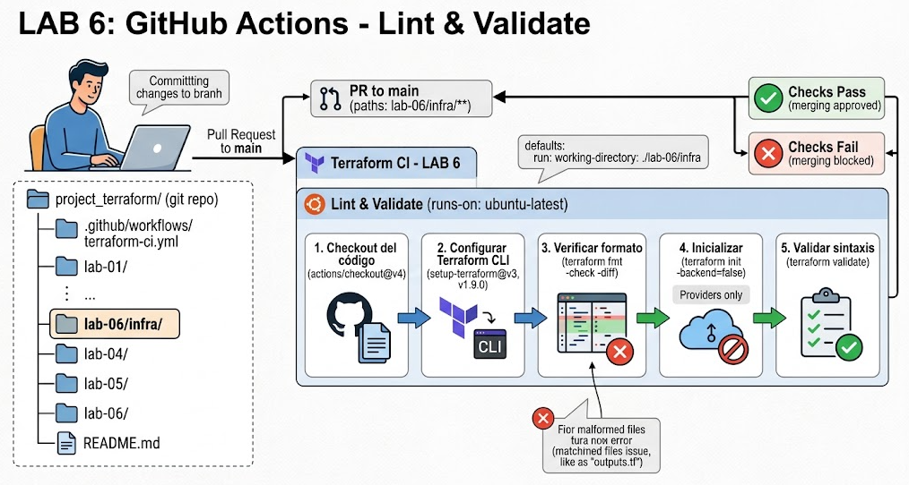
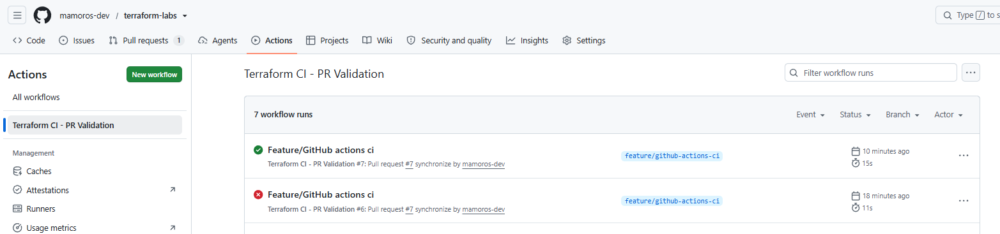
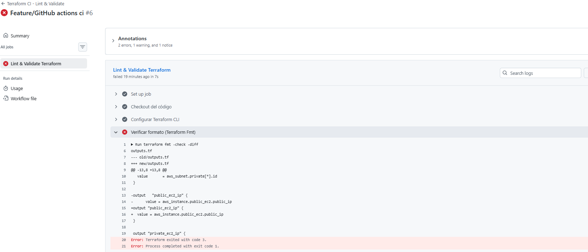

# LAB 6: GitHub Actions para Lint y Tests en Pull Requests

  

## Table of contents

- [Ejercicio](#ejercicio)
- [Fichero workflow](#fichero-workflow)
- [Lint](#lint)
- [Verificacion](#verificacion)
- [Author](#author)

## Ejercicio

+ Configuraremos un workflow de GitHub Actions que se activará automáticamente cada vez que alguien abra o actualice una Pull Request (PR) hacia la rama principal (main).
+ Este pipeline ejecutará tres validaciones clave:
    - Formatting (terraform fmt): Comprueba que el código siga el formato estándar de HCL.
    - Initialization (terraform init): Descarga los proveedores y verifica la estructura.
    - Validation (terraform validate): Revisa la sintaxis interna y la coherencia de las referencias/variables.

## Fichero workflow

```bash
name: "Terraform CI - Lint & Validate"

on:
  pull_request:
    branches:
      - main
    paths:
      - "**.tf"
      - "**.tfvars"
      - "lab-06/infra/**"

jobs:
  lint-and-validate:
    name: "Lint & Validate Terraform"
    runs-on: ubuntu-latest

    # Establecemos el directorio donde se encuentran los archivos .tf
    defaults:
      run:
        working-directory: ./lab-06/infra

    steps:
      - name: Checkout del código
        uses: actions/checkout@v4

      - name: Configurar Terraform CLI
        uses: hashicorp/setup-terraform@v3
        with:
          terraform_version: "1.9.0"

      - name: Verificar formato (Terraform Fmt)
        run: terraform fmt -check -diff

      - name: Inicializar Terraform (Init Backend Simulado/Backend-less)
        run: terraform init -backend=false

      - name: Validar sintaxis (Terraform Validate)
        run: terraform validate
```
+ pull_request: Le dice a GitHub que ejecute este workflow únicamente al crear o actualizar una PR.

+ branches: [main]: Solo se activa si la PR apunta a fusionarse dentro de main.

+ paths: Optimización de recursos. Solo ejecuta el workflow si la PR modifica archivos con extensión .tf o .tfvars. Si solo modificas un README.md, el pipeline no perderá tiempo ni minutos de GitHub Actions.

+ runs-on: ubuntu-latest: Asigna una máquina virtual efímera basada en Ubuntu alojada en la nube de GitHub para ejecutar los pasos.

+ name: Checkout del código: Usa una acción oficial de GitHub para clonar el repositorio dentro del runner en el estado exacto del commit de la Pull Request.

+ name: Configurar Terraform CLI: Descarga e instala la versión exacta del binario de Terraform en la máquina virtual para garantizar consistencia entre entornos.

+ name: Verificar formato (Terraform Fmt):
    - -check: Hace que el comando devuelva un código de error (haciendo fallar el pipeline) si detecta código mal formateado o mal alineado.
    - -diff: Muestra en los logs del runner la diferencia exacta línea por línea entre el archivo actual y la forma correcta según la guía de estilo oficial de HashiCorp.

+ name: Inicializar Terraform (Init Backend Simulado/Backend-less): -backend=false: Esencial para CI/CD de validación estática. Inicializa y descarga únicamente los providers (AWS, Azure, etc.) y módulos, pero omite la conexión al estado remoto (S3, DynamoDB, etc.). Esto evita la necesidad de configurar credenciales de AWS reales solo para revisar si la sintaxis del código es correcta.

+ name: Validar sintaxis (Terraform Validate): Comprueba la consistencia sintáctica dentro del directorio: referencias a variables no declaradas, tipos de datos incorrectos en recursos, atributos inexistentes en providers, etc.

+ working-directory: ./lab-06/infra: Le indica a GitHub Actions que todos los comandos (terraform fmt, init, validate y tflint) deben ejecutarse en esa carpeta específica donde están tu outputs.tf, main.tf, etc.

+ paths: - "lab-06/infra/**": El workflow solo se ejecutará cuando detecte cambios reales en cualquier archivo dentro de lab-06/infra/.

+ Paso de TFLint (terraform-linters/setup-tflint): Instala el binario oficial de tflint. A diferencia de terraform fmt (que solo mira espacios y alineación), tflint analiza el código en busca de buenas prácticas, como nombres de variables no utilizados o sintaxis obsoleta.

## Lint
+ Un Linter (o la acción de hacer linting) es una herramienta de análisis estático de código. Su trabajo es examinar tu código sin ejecutarlo para encontrar errores de sintaxis, violaciones de estilo, inconsistencias o posibles fallos antes de que lleguen a producción.

+ Piensa en el linter como el corrector ortográfico y gramatical de Word:
    - No lee el contenido para entender tu historia, pero se da cuenta de inmediato si escribiste una palabra al revés, te saltaste una tilde o dejaste cinco espacios innecesarios entre dos palabras.

+ ¿Qué función cumplió cada comando en el Pipeline?
    - En el LAB 6, usamos dos tipos de validación que componen el proceso de linting y calidad:
    `terraform fmt -check -diff (Linting de estilo / formato)`  

+ ¿Qué hizo?: Analizó la alineación y los espacios en tus archivos .tf.

+ El fallo real que detectó: En tu outputs.tf, tenías espacios irregulares:
```bash
# Así estaba tu código (mal alineado)
output   "public_ec2_ip" {
      value = aws_instance.public_ec2.public_ip
}

La corrección que exigió:
# Así debía quedar según el estándar oficial de HashiCorp
output "public_ec2_ip" {
  value = aws_instance.public_ec2.public_ip
}
```

+ Como le pusimos el parámetro -check, en cuanto vio esa sangría incorrecta, hizo fallar el pipeline (código de salida 3) para bloquear el PR hasta que lo corrigieras.
`terraform validate (Linting de sintaxis y coherencia)`  
> ¿Qué hace?: Comprueba que los bloques HCL sean válidos. Por ejemplo, si pones resourc en lugar de resource, o si haces referencia a una variable var.subnet_id que no has declarado en variables.tf, este comando lo detecta y falla.

## Verificacion

  

  

## Author
+ Miguel — [GitHub](https://github.com/mamoros-dev) · [LinkedIn](https://www.linkedin.com/in/miguel-amoros-moret/)
